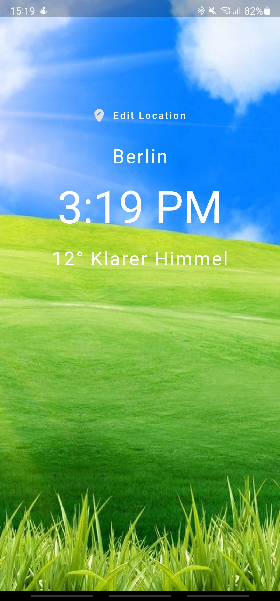
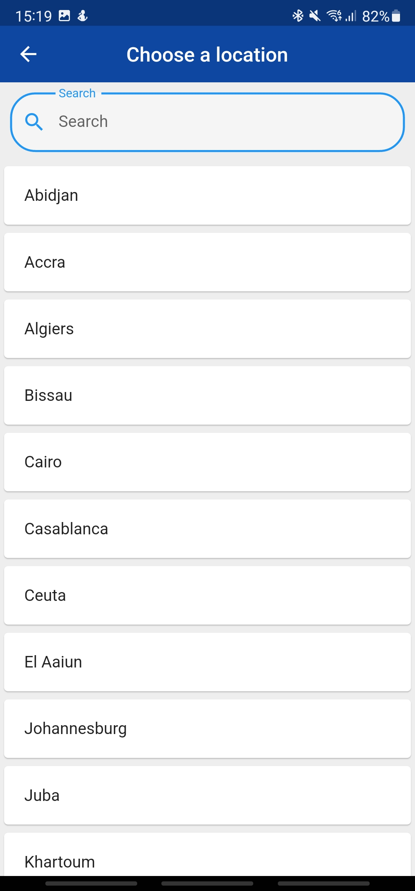

# :clock1: Flutter World Time App :clock1:

A simple Flutter app to get time and weather in world's cities.  
This app should help you to learn flutter.

The [Worldtime API](http://worldtimeapi.org) was used to fetch times.  
The [OpenWeatherMap API](https://api.openweathermap.org) was used to fetch weather infos.  

Please star ⭐ the repo if you like what you see😉.

## 💻 Requirements
- Any Operating System (ie. MacOS X, Linux, Windows)
- Any IDE with Flutter SDK installed (ie. IntelliJ, Android Studio, VSCode etc)
- A little knowledge of Dart and Flutter

## ✨ Features
- [x] Sarch by city name.
- [x] Swipe down to refresh time and weather.
- [x] the last viewed city is saved and displayed the next time the app is opened

## 📸 ScreenShots
|  |    |
